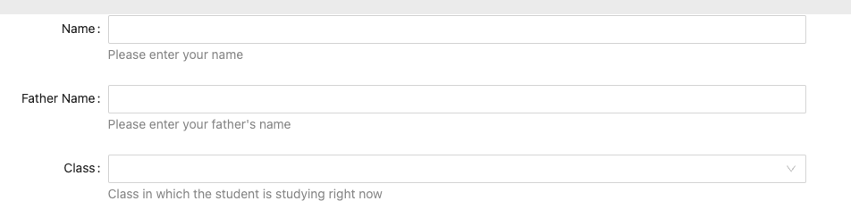

# Formily <> Flowise Compiler

Sample JSONs have three questions, two are text input one is options input.

## Tasks

### Current

- [ ] Only target `input` and `select` type of fields
- [ ]  All questions are compulsory by default.

### Future
- [ ] Expand for more input times
- [ ] Allow for non-required questions